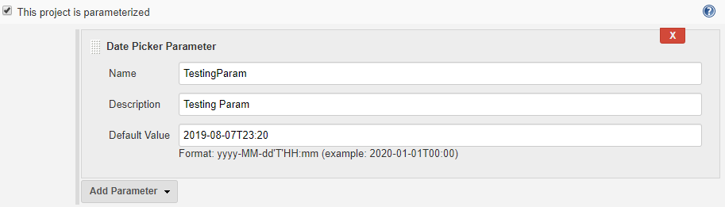
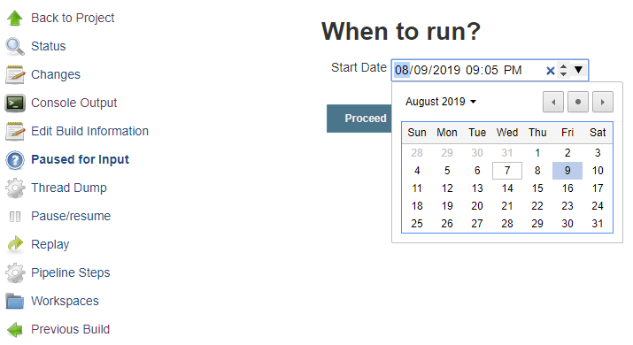

# Date Picker Plugin (for jenkins)
Date Picker Plugin for Jenkins Pipeline (built with Gradle)

### Based on the code from:
https://github.com/jenkinsci/date-parameter-plugin

Thanks to Github User:
##### JuHyun Lee (leejaycoke)

### About parameters:

- Name: Mandatory
  
- Description: Optional
  
- Default Value:

  1. Can be blank.

  2. Format: `yyyy-MM-dd'T'HH:mm`

     Example: `2020-01-01T14:10`
 
     Defaulted to ISO format `yyyy-MM-dd'T'HH:mm` (output of `<input type="datetime-local"/>`)

### Usage:

- Parameterized:



- Pipeline Script:

```
def userInput = input (
    id: 'startDate', 
    message: "When to run?", 
    parameters: [
        [
            $class: 'DatePickerDefinition', 
            description: 'Date to run', 
            name: 'Start Date', 
            defaultValue: '2020-01-01T00:00'
        ]
    ]
)
echo ("Start Date: " + userInput)
```


