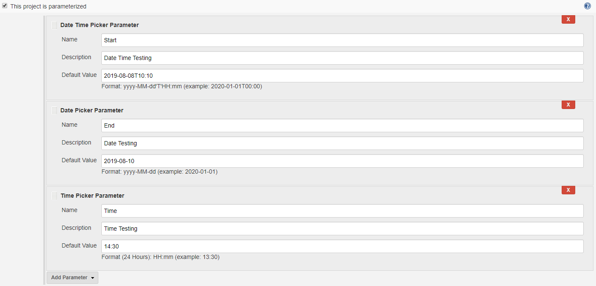
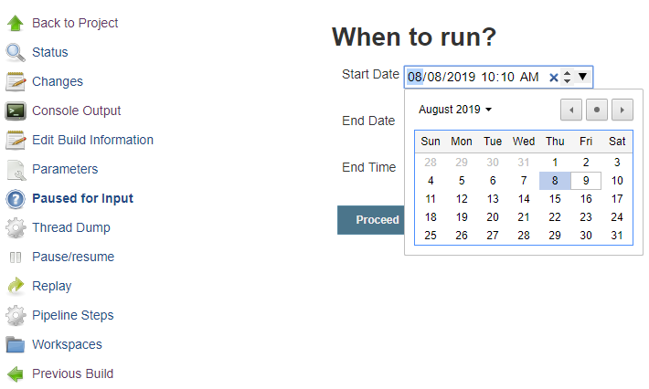
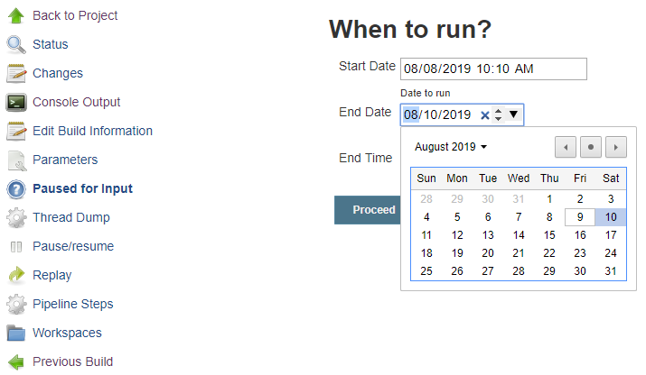
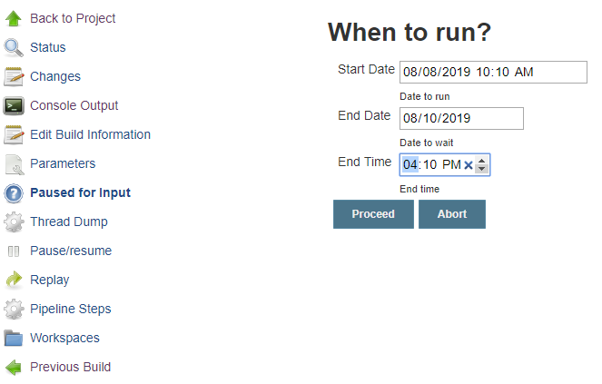
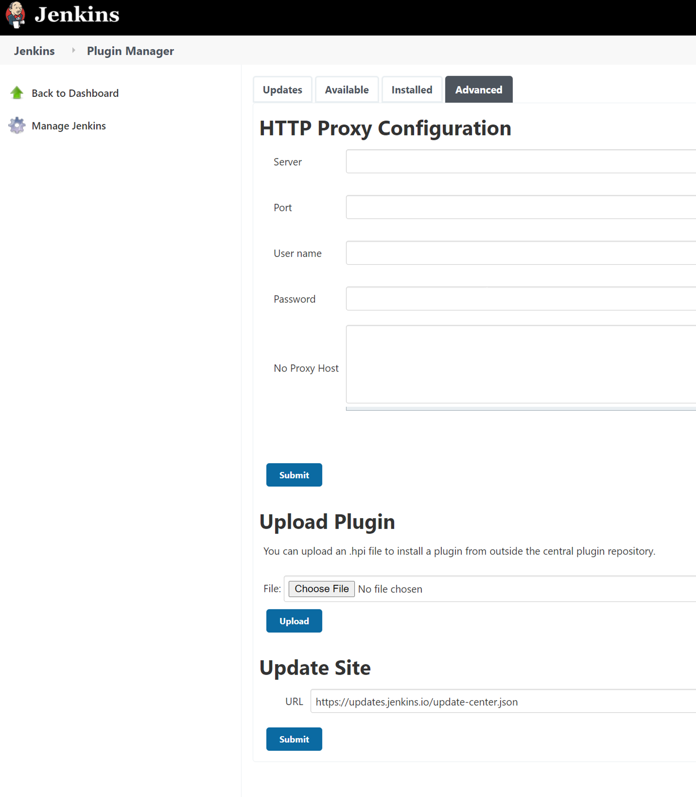

# Date Picker Plugin
Date Picker Plugin for Jenkins (built with Gradle)


### Author:

###### Name: Vimalraj Chandra Sekaran
###### Github ID: rajvimalc
###### Email: rajvimalc@gmail.com

### Based on the code from:
https://github.com/jenkinsci/date-parameter-plugin
##### Thanks to Github User: JuHyun Lee (leejaycoke)


## About parameters:

#### Class: DatePickerDefinition

- Name: Mandatory
  
- Description: Optional

- Picker Type: Mandatory
    
  Select Options: 
  
        DATE_TIME (yyyy-MM-dd'T'HH:mm)
        DATE (yyyy-MM-dd)
        TIME (HH:mm)
  
- Default Value: Optional

  ##### 1. Picker Type: `DATE_TIME (yyyy-MM-dd'T'HH:mm)`
  
     Example: `2020-01-01T14:10`
   
     Defaulted to ISO format `yyyy-MM-dd'T'HH:mm` (output of `<input type="datetime-local"/>`)
  
  ##### 2. Picker Type: `DATE (yyyy-MM-dd)`

     Example: `2020-01-01`
 
     Defaulted to `yyyy-MM-dd` format (output of `<input type="date"/>`)

  ##### 3. Picker Type: `TIME (HH:mm)`

     Example: `14:10`
 
     Defaulted to `HH:mm` format (output of `<input type="time"/>`)


### Usage:

- Parameterized:



- Pipeline Script:

```
node {
    stage('Init') {
       echo ("Initializing...")
    }
    def dates = input (
        id: 'dates', 
        message: "When to run?", 
        parameters: [
            [
                $class: 'DatePickerDefinition', 
                name: 'Start Date Time', 
                description: 'Date to start', 
                type: 'DATE_TIME', 
                defaultValue: '2019-08-08T15:30'
            ],[
                $class: 'DatePickerDefinition', 
                name: 'End Date', 
                description: 'Date to end', 
                type: 'DATE', 
                defaultValue: '2019-08-10'
            ],[
                $class: 'DatePickerDefinition', 
                name: 'End Time', 
                description: 'Time to end', 
                type: 'TIME', 
                defaultValue: '09:15'
            ]
        ]
    )
    echo ("Date to Start: " + dates['Start Date Time'])
    echo ("Date to End: " + dates['End Date'])
    echo ("Time to End: " + dates['End Time'])
}
```





#### Console Output:
```
Started by user Vimalraj Chandra Sekaran
Running in Durability level: MAX_SURVIVABILITY
[Pipeline] Start of Pipeline
[Pipeline] node
Running on Jenkins in C:\Program Files (x86)\Jenkins\workspace\Date Picker Job
[Pipeline] {
[Pipeline] stage
[Pipeline] { (Init)
[Pipeline] echo
Initializing...
[Pipeline] }
[Pipeline] // stage
[Pipeline] input
Input requested
Approved by Vimalraj Chandra Sekaran
[Pipeline] echo
Date to Start: 2019-08-08T15:30
[Pipeline] echo
Date to End: 2019-08-10
[Pipeline] echo
Time to End: 09:15
[Pipeline] }
[Pipeline] // node
[Pipeline] End of Pipeline
Finished: SUCCESS
```


#### Installation:

Use the ‘Upload Plugin’ option at and install the .hpi file.

http://localhost:8888/pluginManager/advanced



It should look like this after installation at ‘Installed’ tab (version will be 1.0).


